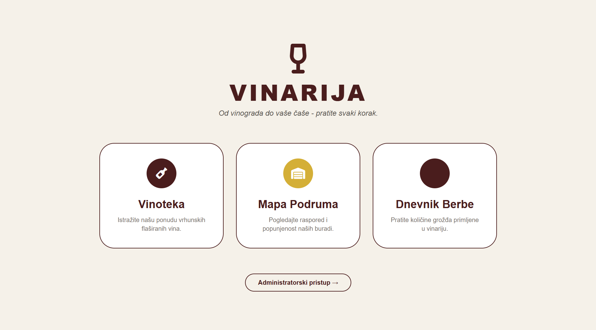
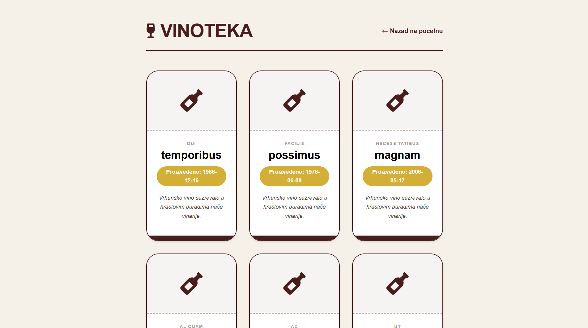
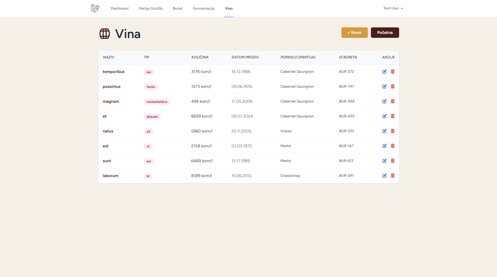
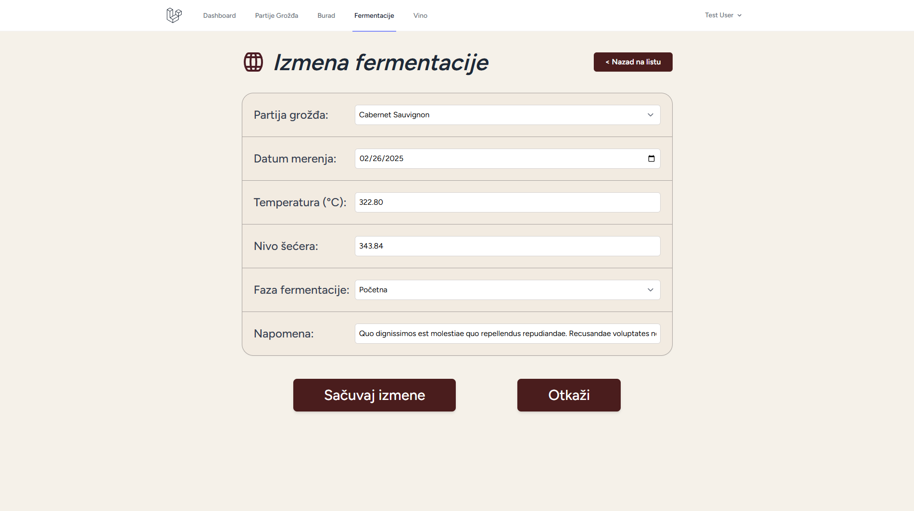
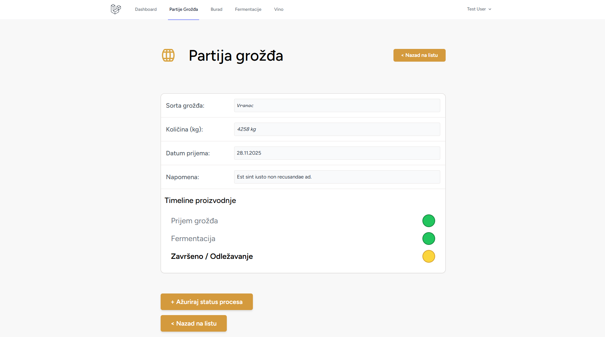

# Sistem za evidenciju proizvodnje vina
Ovaj projekat predstavlja veb aplikaciju za digitalizaciju procesa proizvodnje vina, omogućavajući praćenje toka od prijema grožđa, preko fermentacije, do perioda odležavanja u buradima, i na kraju gde dobijamo finalni proizvod - vina.

## Pregled aplikacije






## Github repozitorijum
- Link: https://github.com/Luka777-c/vinarstvo

## Korišćeni alati
Korišćeni su sledeći razvojni okviri, alati i biblioteke:
- **Laravel 11 (PHP Framework):** Osnova backend logike, rutiranja i rada sa bazom
- **Visual Studio Code:** Integrisano razvojno okruženje (IDE) sa ekstenzijama za PHP i Laravel (Intelephense, Blade Snippets)
- **Composer:** Menadžer zavisnosti za PHP
- **XAMPP:** Lokalni server (Apache + MySQL) za pokretanje aplikacije
- **Github:** Sistem za kontrolu verzija i repozitorijum koda
- **Tailwind CSS:** Za stilizovanje korisničkog interfejsa (UI)
- **Laravel Pint:** Alat za automatsko formatiranje i stilizovanje PHP koda (Code Style)
- **Blueprint:** Automatsko generisanje laravel komponenti
- **Breeze:** Automatska implementacija autentifikacija za veb server
- **PHPUnit:** Za automatizovano testiranje (Feature testovi)
- **GitHub Actions:** Za CI/CD (kontinuiranu integraciju) i automatsko pokretanje testova

## Struktura koda i implementacija
### Blueprint skripta
- Korišćen blueprint alat za automatsko generisanje laravel komponenti na osnovu `draft.yaml` skripte:
``` YAML
models:
  PartijaGrozdja:
    sorta: string:100
    kolicina: integer
    status: enum:prijem,u_obradi,zavrseno
    datum: date
    napomena: text nullable
    relationships:
      hasMany: Fermentacija, Vino

  Fermentacija:
    partija_grozdja_id: id
    datum: date
    temperatura: decimal:5,2
    secer: decimal:5,2
    faza: string
    napomena: text nullable
    relationships:
      belongsTo: PartijaGrozdja

  Bure:
    broj_bureta: string unique
    kapacitet: integer
    tip_drveta: string
    status: enum:prazno,puno,ciscenje
    napomena: text nullable
    relationships:
      hasMany: Vino

  Vino:
    naziv: string
    tip: string
    kolicina: integer
    datum_proizvodnje: date
    partija_grozdja_id: id
    bure_id: id foreign:burad
    relationships:
      belongsTo: PartijaGrozdja, Bure

seeders: PartijaGrozdja, Bure, Fermentacija, Vino

controllers:
  PartijaGrozdja:
    resource: index, create, store, edit, update, destroy
  Fermentacija:
    resource: index, create, store, edit, update, destroy
  Bure:
    resource: index, create, store, edit, update, destroy
  Vino:
    resource: index, create, store, edit, update, destroy
```

#### Baza podataka i Migracije (database/migrations)
- Generisano: Fajlovi migracija sa osnovnom up() i down() strukturom, kao i podrazumevana polja id i timestamps.
- Ručno pisano: 
    * Unutar metode up(), ručno su definisane šeme tabela:
    * Dodavanje kolona specifičnih tipova ($table->string(), $table->decimal(), $table->date()).
    * Definisanje stranih ključeva (foreignId('partija_grozdja_id')->constrained()) radi povezivanja tabela.
    * Dodavanje indeksa i ograničenja (npr. unique za broj bureta).

#### Modeli (app/Models)
- Modeli predstavljaju sloj podataka i poslovne logike.
- Generisano: Osnovna klasa koja nasleđuje Illuminate\Database\Eloquent\Model i HasFactory trait.
- Ručno pisano:
    * `$fillable` niz: Definisana su polja koja se smeju masovno upisivati (Mass Assignment Protection), čime se štiti baza od malicioznih unosa.
    * Relacije: Implementirane su metode belongsTo i hasMany koje povezuju entitete.
        * Primer: U modelu Vino, napisana je metoda partijaGrozdja() koja definiše da vino pripada jednoj partiji grožđa.
    * Casting: Podešavanje tipova podataka (npr. konverzija datuma).

#### Kontroleri (app/Http/Controllers)
- Kontroleri obrađuju HTTP zahteve i povezuju modele sa view-ovima.
- Generisano: Klasa kontrolera i prazne metode (stubs) za 7 standardnih RESTful akcija: index, create, store, show, edit, update, destroy.
- Ručno pisano (Srž aplikacije):
    * index metoda: Implementirano dovlačenje podataka iz baze i slanje u View.
    * store i update metode:
        * Implementirana validacija ($request->validate()) koja proverava tipove podataka i obavezna polja pre upisa.
        * Logika snimanja u bazu korišćenjem Eloquent ORM-a.
        * Redirekcija korisnika nakon uspešne akcije sa flash porukom.
    * Specifična logika: U VinoController i FermentacijaController, ručno je dodato povlačenje povezanih podataka (npr. lista slobodnih buradi) kako bi se prikazali u padajućim menijima (select box).

#### Korisnički interfejs / View (resources/views)
- Ovaj deo aplikacije je u potpunosti ručno kreiran, jer Laravel ne generiše HTML kod za specifične forme.
* Struktura: Organizovana u podfoldere po entitetima (vino, bure...).
* Layout: Kreiran je layouts/app.blade.php kao glavni šablon koji sadrži navigaciju i učitava CSS stilove, kako bi se izbeglo ponavljanje koda.
* Blade sintaksa: Korišćene su direktive @foreach za ispis tabela, @if za prikaz grešaka i @csrf za zaštitu formi.
* Dizajn: Primenjene su Tailwind CSS klase za stilizovanje tabela, dugmadi i formi, čime je postignut moderan i responzivan izgled (prilagođen mobilnim uređajima).

#### Rutiranje (routes/web.php)
- Generisano: Prazan fajl sa osnovnom rutom.
- Ručno pisano:
    * Definisane su Route::resource linije koje automatski mapiraju URL-ove na metode kontrolera.
    * Dodat je middleware(['auth']) koji štiti rute, onemogućavajući neulogovanim korisnicima pristup aplikaciji.


#### Implementirani use cases
* Aplikacija pokriva tri ključna procesa proizvodnje kroz jednostavan korisnički interfejs. 
    - Prvi deo omogućava pregled prijema sirovine gde tehnolog unosi podatke o sorti, količini i kvalitetu grožđa.
    - Drugi deo služi za upravljanje buradima i praćenje toka fermentacije kroz dnevna merenja. 
    - Treći deo objedinjue ove podatke kreiranjem finalnog zapisa o vinu, čime se povezuju sirovina i sudovi radi potpune sledljivosti proizvoda.

### Testovi
#### Testiranje unosa podataka (KreiranjeGrozdjaTest.php)
* Opis: Proverava "Happy Path" scenario – da li sistem uspešno prihvata validne podatke.
* Metodologija: Test šalje POST zahtev sa podacima o grožđu.
* Verifikacija: Koristi se assertDatabaseHas metoda da se potvrdi da je zapis fizički upisan u bazu podataka, i assertRedirect da se potvrdi preusmerenje korisnika.

#### Testiranje poslovnih pravila (ValidacijaBuretaTest.php)
* Opis: Proverava robusnost sistema na greške i duplikate.
* Scenario: Pokušaj unosa bureta sa brojem "B-100" koji već postoji u bazi.
* Verifikacija: Test očekuje da sistem vrati grešku validacije (assertSessionHasErrors), čime se potvrđuje da mehanizam zaštite integriteta podataka radi ispravno.

#### Testiranje relacija (KreiranjeFermentacijeTest.php)
* Opis: Proverava integritet veza između tabela (Foreign Keys).
* Scenario: Kreiranje zapisa fermentacije koji mora biti vezan za postojeću partiju grožđa.
* Verifikacija: Potvrđuje se da je strani ključ (partija_grozdja_id) ispravno sačuvan.

#### Testiranje ažuriranja podataka (PromenaStatusaGrozdjaTest.php)
* Opis: Proverava funkcionalnost izmene (Update).
* Scenario: Promena statusa ili napomene na postojećoj partiji.
* Verifikacija: Potvrđuje se da su novi podaci prisutni, a stari podaci uklonjeni (assertDatabaseMissing).


### Github akcije
* U repozitorijumu je konfigurisan GitHub Actions workflow koji služi za kontinuiranu integraciju i automatsku proveru koda. 
* Pri svakom slanju izmena na GitHub (git push), sistem automatski podiže testno okruženje, instalira potrebne zavisnosti i pokreće sve definisane testove. 
* Github actions skripta `testovi.yaml`:
``` YAML
name: Testovi Laravel

on: 
  push:
    branches:
      - '*'
  pull_request:
    branches:
      - '*'
    
jobs:
  test:
    runs-on: ubuntu-latest


    steps:
      - name: Proveru koda
        uses: actions/checkout@v4

      - name: Podesavanje PHP-a 
        uses: shivammathur/setup-php@v2
        with: 
          php-version: '8.4'
          extensions: mbstring, dom, fileinfo, pdo, mysql, json, curl, sqlite3
          coverage: none

      # composer zavisnosti
      - name: Kes composer zavisnosti
        uses: actions/cache@v4
        with: 
              path: vendor
              key: ${{ runner.os }}-composer-${{ hashFiles('**/composer.lock') }}
              restore-keys: |
               ${{ runner.os }}-composer-

      - name: Instalacija composer paketa
        run: composer install --prefer-dist --no-progress --no-interaction

      - name: Kopiranje .env.example u .env fajl
        run: cp .env.example .env

      - name: Generisanje aplikacijskog kljuca
        run: php artisan key:generate

      # baza za testiranje
      - name: Create Database
        run: |
          touch database/database.sqlite

      # migracije
      - name: Execute Migrations
        env:
          DB_CONNECTION: sqlite
          DB_DATABASE: database/database.sqlite
        run: php artisan migrate --force
      
      - name: Provera code style koristeci Pint
        run: ./vendor/bin/pint --test

      - name: Pokretanje testova
        env:
          DB_CONNECTION: sqlite
          DB_DATABASE: database/database.sqlite
        run: php artisan test

      - name: Uspesno zavrsen posao
        run: echo "✅Uspesno!"
```